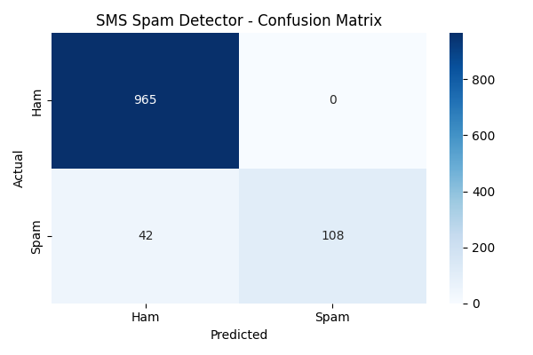

# 📱 SMS Spam Detection using Machine Learning (NLP Project)

This is a real-world **Natural Language Processing (NLP)** project that detects whether an SMS message is **Spam** or **Ham (Not Spam)** using Machine Learning.

## 🚀 Live Demo
👉 [Click here to try the app](https://ubaidrees-sms-spam-detector-app-rvw7nm.streamlit.app/)
It uses:
- ✅ Python  
- ✅ TF‑IDF Vectorizer  
- ✅ Multinomial Naive Bayes  
- ✅ SMS Spam Collection Dataset  
- ✅ Scikit-learn  

---

## 📌 Project Overview

This project aims to classify SMS text messages as **Spam** or **Ham** based on their content.  
Spam detection is widely used in:

- Gmail  
- WhatsApp  
- Telecom SMS Filters  
- Banking Notifications  

This makes it a **practical real-world project** for beginners in NLP.

---

## 📊 Dataset

The dataset used is the famous SMS Spam Collection Dataset, containing **5574 SMS messages**, labeled as:

- `ham` → Normal message  
- `spam` → Unsafe or promotional message  

---

## 🧽 Data Cleaning & Preprocessing

Steps performed:

1. Removed unnecessary columns  
2. Renamed columns to:  
   - `label`  
   - `message`  
3. Encoded labels:  
   - ham → 0  
   - spam → 1  
4. Train-Test split (80% / 20%)  
5. Converted text to numerical features using **TF‑IDF**

---

## 🤖 Machine Learning Model

Model Used: **Multinomial Naive Bayes**  
Why?
- It works best for text classification  
- Fast & accurate  
- Ideal for spam filtering  

---

## ✅ Model Performance
- ✅ Accuracy: **96.23%**
- ✅ Precision (Spam): **1.00** — Never blocks a real message
- ✅ Recall (Spam): **0.72** — Catches 72% of all spam
- ✅ F1 Score: **0.84**

## 📊 Confusion Matrix


## 🔮 Predicting Custom Messages

Example:

```python
predict_message("You won 50000 rupees! Claim now!")
# Output: SPAM


